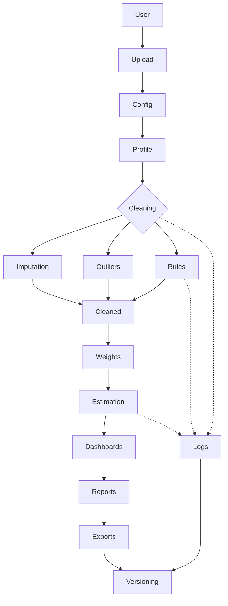

# Technological Approach: AI‑Augmented Survey Data Processing Tool

## Objectives
Build a low‑code, configurable web app to ingest raw survey data (CSV/Excel), perform automated cleaning (imputation, outlier detection, rule checks), apply survey design weights, compute estimates with margins of error, and generate standardized reports (HTML/PDF).

## Architecture Overview
- Frontend/UI: Streamlit for rapid, low‑code interactive UI.
- Processing: Python data stack (pandas, numpy) with scikit‑learn for imputation/outliers; optional MissForest (missingpy).
- Visualization: matplotlib + seaborn for charts.
- Reporting: HTML via templating and optional PDF via ReportLab.
- File I/O: pandas (read_csv/read_excel via openpyxl).
- Config: JSON schema mapping for renaming, type coercion, and validation rule definitions.
- Reproducibility: Export workflow.json with logs, rules, and DP epsilon for audit.

## Core Modules
1. Data Ingestion & Configuration
   - Upload CSV/Excel, detect delimiter, header, encodings.
   - Optional schema mapping (rename, dtypes) via JSON.
   - Basic EDA: rows, columns, missingness, type breakdown.

2. Cleaning Pipeline
   - Imputation: mean/median/mode, KNN, IterativeImputer, optional MissForest.
   - Outliers: Z-score, IQR; optional IsolationForest; optional winsorization.
   - Rule-Based Validation: required, range(min/max), regex, uniqueness, allowed values; failure export.

3. Weighting & Estimation
   - Select weight column.
   - Weighted/unweighted means, standard errors, margins of error, confidence intervals.
   - Effective sample size under weights; optional differential privacy noise.

4. Dashboards & Diagnostics
   - Distributions, correlations, missingness.
   - Estimation plots with error bars.

5. Reporting
   - HTML report: overview, estimates, logs.
   - Optional PDF report: lightweight summary via ReportLab.

6. Export & Provenance
   - cleaned.csv, estimates.csv, workflow.json (logs, rules, DP epsilon).

## Data Flow
1) Upload -> 2) Schema Map -> 3) Profile -> 4) Cleaning (Impute/Outliers/Rules) -> 5) Weights -> 6) Estimation -> 7) Dashboards -> 8) Reporting -> 9) Export.

## Innovative Enhancements (from research PDF)
- Configurable modules with frontier methods: IsolationForest, IterativeImputer, MissForest.
- Differential privacy knob (epsilon) on estimates for privacy-preserving releases.
- Audit logs of all steps and downloadable validation failure artifacts.
- Templated report generation and reproducible workflow export.
- Low-code UI that exposes advanced options safely with tooltips and defaults.

## Minimal Viable Stack
- streamlit, pandas, numpy, scikit-learn, missingpy (optional), matplotlib, seaborn, reportlab (optional), openpyxl.

## Security & Governance
- No external network calls; process data in-session.
- Export artifacts for review; deterministic where possible except DP noise.

## Future Scope
- Winsorization and robust estimators; stratified weighting and variance estimation (Taylor linearization, replicate weights).
- More report templating (Jinja2), multi-page PDFs, and branding.
- Authentication, role-based access, and full audit trails.
- Pluggable storage backends (S3/Azure Blob) and dataset catalogs.

## Methodology Flowchart

